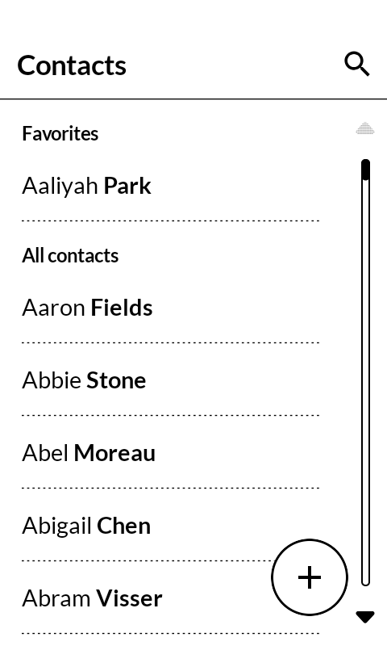
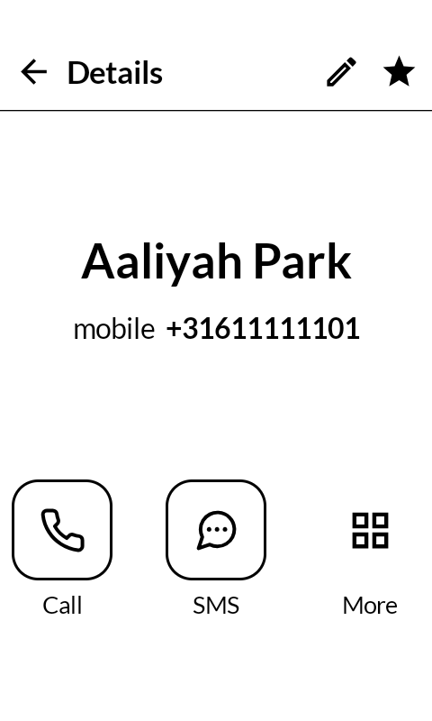
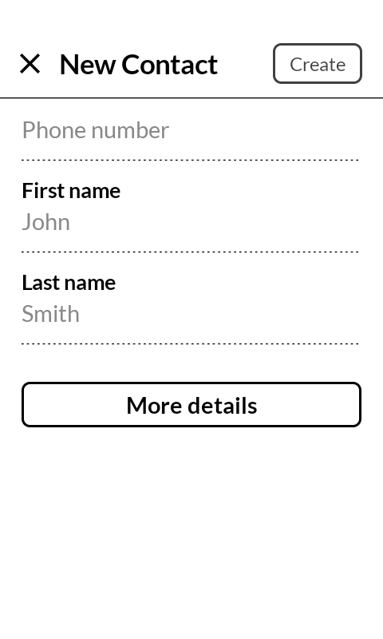

# MonoContacts

An address book for the Mudita Kompakt, built with MMD (Mudita Mindful Design). It shows on your launcher as "Contacts". The app recreates the stock MuditaOS contacts app so it can be used on Kompakts running other Android systems (like LineageOS), where the stock app cannot run.

Everything works on your phone's own contact database: contacts you add or edit here show up in every other app that uses contacts, and the other way around. If you use a contact sync app like DAVx5, its contacts appear here too, edits sync back through it, and new contacts are created in that account so they sync as well; without one, contacts stay on the phone. The app itself has no internet access at all.

  
  
  

## What it does

The main screen lists all contacts alphabetically, with a search button at the top and a round plus button to add someone new. Tapping a contact shows their details with three actions: Call (places the call), SMS (opens your messaging app), and More (every stored field at a glance). From the details you can star someone as a favorite, edit all their fields (names, phone numbers with types, email, nickname, company, department, notes), or delete them.

## Install

Download the latest APK from the [releases page](../../releases) and sideload it,
or build from source:

    ./gradlew installDebug

On first start the app asks for contacts access, which it needs to do anything at all. The Call button asks for phone permission the first time you use it; if you decline, it opens the dialer with the number filled in instead.

## Structure

- `MainActivity.kt` - screen navigation and permission gate
- `ContactsViewModel.kt` - contact list state, watches the contact database for changes
- `data/ContactsRepository.kt` - reads and writes contacts through Android's contacts provider
- `ui/ListScreen.kt` - alphabetical contact list with the add button
- `ui/SearchScreen.kt` - live search over the list
- `ui/DetailsScreen.kt` - single contact with Call, SMS and More actions
- `ui/MoreScreen.kt` - all stored fields of a contact
- `ui/EditScreen.kt` - editor for new and existing contacts
- `ui/PermissionScreen.kt` - first-run contacts access request
- `ui/Components.kt` - dotted divider, outlined add button, shared styling

## Support

If you find this app useful, consider [sponsoring me](https://github.com/sponsors/berendsliedrecht).

## License

[MIT](LICENSE)
